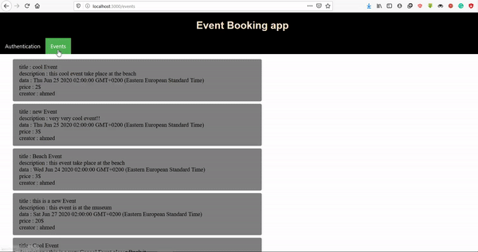
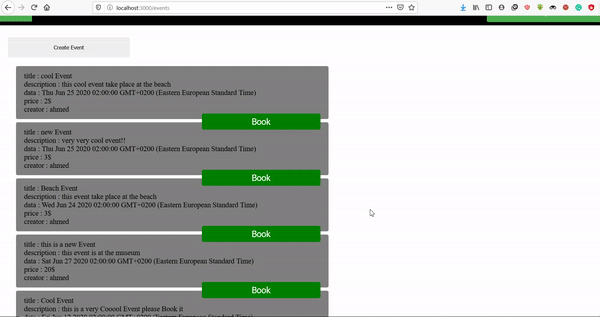

# event-booking
Responsive React and GraphQl web app

## Description 
Responsive React web app sending requests to back-end server that uses Graphql as end point, after the user creates an account
and login the server then generates JWT(json web token) for that user which is saved in the memory of the browser, then the application
passes this token between it's function to make multiple authorized requests, to OverCome the problem of the token being lost 
there are two solutions adapted by developers here either saving it in an `httpOnly Cookie` or `localStorage`, i chose to save it in a local Storage

## Installation 

1-Open terminal and type `git clone https://github.com/ahmedmagdy11/event-booking`. 
2-make sure you have node and mongoDB installed on your System.
3-`npm install`. 
after this is done 
5-`npm start`
this last step will only install back-end Server dependencies. 

so following to the next step. 

4-open another terminal and type `cd frontend` 
5-`npm install` then `npm start` 
and also don't forget to start your Mongod service by typing `mongod `in your terminal for further information visit [docs](https://docs.mongodb.com/)  
Now React app will be auto-opened in your default Browser you can now use the app.

## Expected Result.
# part1
 
in the above gif the user creates an account and login and then tries to book some Events.  
they can't book the same event twice.  
 
 
 
 

# part2
 
in part2 they can canel the events they've booked and logout. 

Also you can notice that some buttons appear depending on if there is a user logged in or no 
like **Create Event**, **Book** and **logout** buttons.

## Contributing 

pull requests are Welcome and you can contact me via Email ahmed.magdy.9611@gmail.com or [facebook](https://www.facebook.com/profile.php?id=100006810076908) 

~Enjoy and thanks for Reading.

